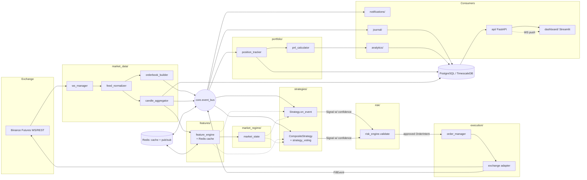
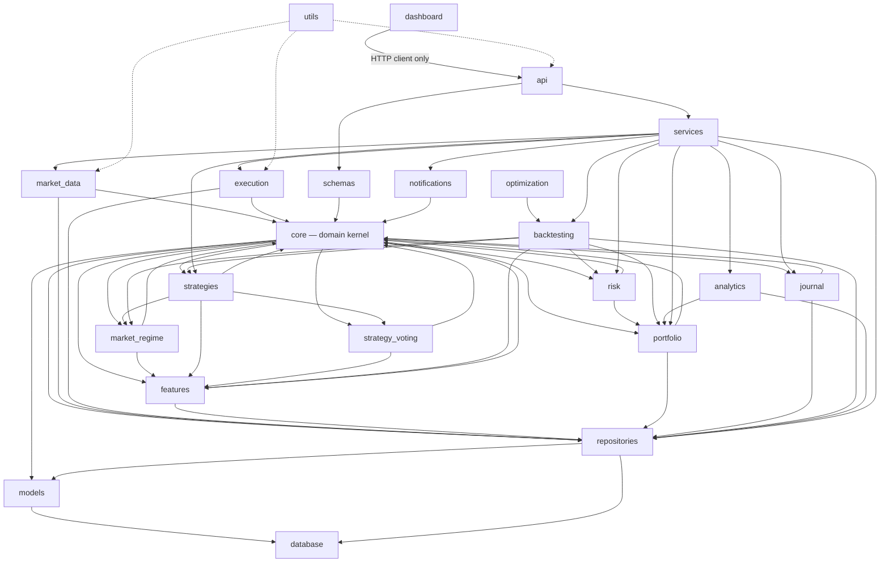
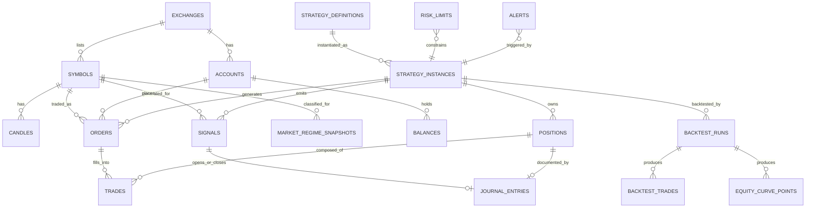
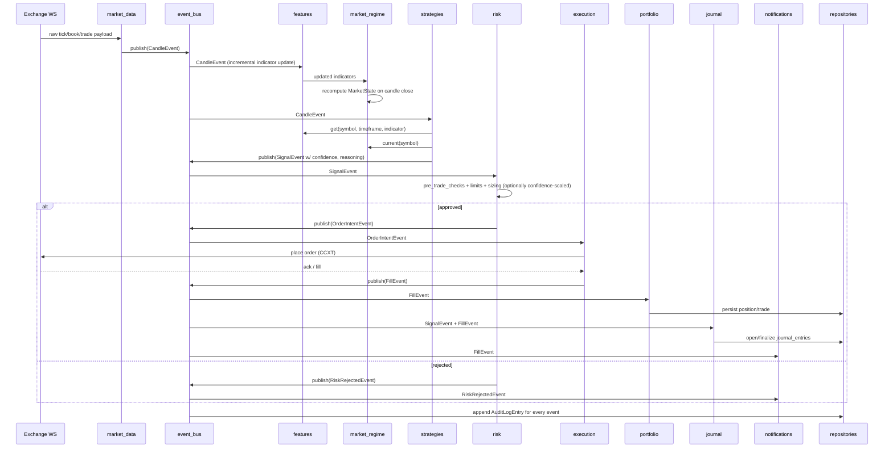

# Architecture Blueprint — Institutional Algorithmic Crypto Trading Platform

Status: **Planning phase — no production code has been written.** This document is
the architecture deliverable requested before implementation begins. It must be
reviewed and approved before any module in this tree is implemented.

Stack: Python 3.12+, FastAPI, PostgreSQL (+ TimescaleDB extension recommended for
time-series tables), Redis, Docker/Docker Compose, SQLAlchemy 2.x, Alembic, CCXT /
CCXT Pro, Pydantic v2, Pytest, Ruff, Black, Mypy, Streamlit, GitHub Actions.

## Revision note (this version)

This is a revision following an architecture review. Summary of what changed and why
— treat this as an informal ADR for the decisions below; full ADRs go in `docs/adr/`
once implementation starts.

| Change | Decision | Reasoning |
|---|---|---|
| Exchange scope | V1 = Binance Futures only. Bybit stays an *interface*, not an implementation. | The `ExchangeGateway` abstraction was already exchange-agnostic; implementing a second exchange in V1 would validate the abstraction but isn't needed to ship. |
| AI research | Removed from V1 entirely, moved to Future Roadmap. | Least load-bearing part of the original V1 scope; the plugin interface (`strategies.base_strategy.Strategy`) is already the contract any future AI-generated strategy must satisfy, so nothing needs to be redesigned to add it later. |
| Optimization | Bayesian search removed from V1; Grid Search + Walk-Forward only. | Validates the optimization *pipeline* (train/test split, overfitting guards) without needing an extra optional dependency (`scikit-optimize`) or tuning a search algorithm before the pipeline itself is proven. |
| Market regime | Added (`market_regime/`), but scoped to indicator-derived detection (trend/range/volatility/bias) only. `sentiment_filter.py` deferred to roadmap. | Sentiment analysis requires a second data-ingestion pipeline (news/social) that doesn't exist anywhere else in V1's Binance-only scope. Building it now would grow V1's surface area instead of shrinking it. Trend/vol regime, by contrast, is derived entirely from data V1 already ingests. |
| Feature engine | Added (`features/`). | Net *reduction* in complexity — without it, every strategy reimplements its own indicators. Centralizing and caching them is cheap and strengthens the foundation. |
| Strategy voting | Added (`strategy_voting/`), but as an **optional, composable pattern** (`CompositeStrategy`), not a mandatory stage between every strategy and Risk. | A mandatory global voting gate collides with the existing multi-strategy model, where each `strategy_instance` owns its own capital, position, and PnL for attribution and walk-forward validation. Making voting an implementation detail *inside* one kind of strategy plugin gets the ensemble pattern without breaking that model or adding a mandatory hop for simple strategies. |
| Trade journal | Added (`journal/`). | Cheap — mostly a structured view over data the system already produces (signals, fills, positions) plus a few new fields. High operational value for a platform meant to run for months. |
| Confidence scoring | Added as a field flowing through `Signal` → `SignalEvent` → Risk → Journal → Dashboard → Backtests → Analytics. | Cheap to carry as data. Scoped to degrade gracefully: simple single-signal strategies compute confidence from whatever inputs they have; composite strategies get the full formula including signal agreement. |

**Version 1 scope** (everything else stays on the roadmap, §20):

- Binance Futures (only exchange)
- Paper Trading
- Live Trading
- Backtesting (event-driven, Grid Search + Walk-Forward optimization)
- Dashboard
- Risk Engine (incl. circuit breaker)
- Strategy Engine (incl. Feature Engine, Market Regime, optional Strategy Voting)
- Portfolio Management
- Trade Journal
- Confidence Scoring

---

## 1. Full Folder Structure

```
quant-trading-platform/
├── .github/
│   └── workflows/
│       ├── ci.yml                     # lint + typecheck + unit + integration
│       ├── docker-build.yml           # build & push images on merge to main
│       └── release.yml                # tag-triggered release pipeline
│
├── config/                            # environment & app configuration
│   ├── settings.py                    # Pydantic BaseSettings, per-env overrides
│   ├── logging.py                     # logging configuration factory
│   └── environments/
│       ├── development.env.example
│       ├── staging.env.example
│       └── production.env.example
│
├── core/                              # domain kernel — zero external deps
│   ├── exceptions.py                  # exception hierarchy
│   ├── constants.py
│   ├── enums.py                       # OrderSide, OrderType, RegimeState, etc.
│   ├── types.py                       # domain value types (Symbol, Money, Price)
│   ├── events.py                      # event dataclasses (see §6)
│   ├── event_bus.py                   # pub/sub abstraction (in-proc + Redis)
│   └── interfaces/                    # ports (ABCs) implemented by outer layers
│       ├── exchange_gateway.py
│       ├── strategy.py
│       ├── repository.py
│       └── notifier.py
│
├── database/                          # infrastructure: persistence wiring
│   ├── session.py                     # async engine/session factory
│   ├── base.py                        # DeclarativeBase, mixins (timestamps, id)
│   └── alembic/
│       ├── versions/
│       └── env.py
│
├── models/                            # SQLAlchemy ORM models (persistence schema)
│   ├── market.py                      # Symbol, Candle, OrderBookSnapshot
│   ├── order.py
│   ├── trade.py
│   ├── position.py
│   ├── account.py                     # Exchange accounts, balances, API keys (encrypted)
│   ├── strategy.py                    # StrategyInstance, StrategyConfig
│   ├── signal.py                      # persisted Signal history (confidence, reasoning, regime)
│   ├── regime.py                      # MarketRegimeSnapshot
│   ├── journal.py                     # JournalEntry
│   ├── backtest.py                    # BacktestRun, EquityCurvePoint
│   └── audit.py                       # AuditLogEntry, RiskEventLog
│
├── schemas/                           # Pydantic DTOs for API/service boundaries
│   ├── market.py
│   ├── order.py
│   ├── position.py
│   ├── strategy.py
│   ├── signal.py
│   ├── regime.py
│   ├── journal.py
│   ├── backtest.py
│   └── common.py                      # pagination, envelopes, error shapes
│
├── repositories/                      # data-access layer (repository pattern)
│   ├── base.py                        # generic CRUD repository
│   ├── market_repository.py
│   ├── order_repository.py
│   ├── trade_repository.py
│   ├── position_repository.py
│   ├── strategy_repository.py
│   ├── signal_repository.py
│   ├── regime_repository.py
│   ├── journal_repository.py
│   └── backtest_repository.py
│
├── market_data/                       # live + historical market data subsystem
│   ├── ws_manager.py                  # connection lifecycle, reconnect/backoff
│   ├── feed_normalizer.py             # exchange-native payload → domain events
│   ├── orderbook_builder.py           # L2 book maintenance from diffs
│   ├── candle_aggregator.py           # trade/tick → OHLCV bar aggregation
│   ├── historical_loader.py           # REST backfill + gap detection
│   └── providers/
│       └── binance_futures.py         # V1: Binance only (see §9 for Bybit path)
│
├── features/                          # centralized, cached indicator calculation
│   ├── feature_engine.py              # get(symbol, timeframe, indicator, params)
│   ├── cache.py                       # Redis-backed incremental cache
│   └── indicators/
│       ├── trend.py                   # EMA, ADX, MACD, Donchian
│       ├── volatility.py              # ATR, Bollinger Bands
│       ├── momentum.py                # RSI
│       ├── volume.py                  # VWAP, Volume Profile
│       └── derivatives.py             # Funding Rate, Open Interest
│
├── market_regime/                     # market state classification
│   ├── trend_detector.py              # trending vs ranging (ADX-based)
│   ├── range_detector.py
│   ├── volatility_detector.py         # high/low vol (ATR-percentile-based)
│   ├── market_state.py                # MarketState value object + aggregator
│   └── (sentiment_filter.py — deferred to roadmap, §20)
│
├── execution/                         # order lifecycle & exchange adapters
│   ├── order_manager.py               # state machine: NEW→SUBMITTED→FILLED/…
│   ├── execution_router.py            # routes intents to correct exchange adapter
│   ├── reconciliation.py              # exchange vs local state reconciliation
│   └── adapters/
│       ├── base_adapter.py            # implements core.interfaces.exchange_gateway
│       ├── paper_adapter.py           # simulated fills against live market data
│       └── binance_adapter.py         # V1: Binance only (see §9 for Bybit path)
│
├── strategies/                        # strategy plugin layer
│   ├── base_strategy.py               # abstract Strategy class
│   ├── composite_strategy.py          # optional ensemble base (uses strategy_voting)
│   ├── registry.py                    # discovery & instantiation of plugins
│   ├── signal.py                      # Signal value object (incl. confidence, reasoning)
│   └── examples/
│       ├── ma_crossover.py
│       └── mean_reversion.py
│
├── strategy_voting/                   # optional signal-ensemble pattern (see §8.3)
│   ├── signal_generator.py            # lightweight sub-signal interface (not a full Strategy)
│   ├── voting_engine.py               # combines sub-signals → final Signal
│   ├── confidence.py                  # composite confidence formula
│   └── generators/
│       ├── trend_following.py
│       ├── momentum.py
│       ├── breakout.py
│       ├── volume.py
│       └── mean_reversion.py
│
├── portfolio/                         # portfolio & position accounting
│   ├── portfolio_manager.py
│   ├── position_tracker.py
│   ├── pnl_calculator.py              # realized/unrealized PnL, funding accrual
│   └── allocator.py                   # capital allocation across strategies
│
├── risk/                              # pre-trade & portfolio risk controls
│   ├── risk_engine.py                 # orchestrates all checks
│   ├── position_sizing.py             # fixed-fractional / vol-target / confidence-scaled
│   ├── limits.py                      # exposure, leverage, concentration limits
│   ├── circuit_breaker.py             # drawdown kill-switch, error-rate trip
│   └── pre_trade_checks.py            # order-level validation pipeline
│
├── analytics/                         # performance measurement & reporting
│   ├── performance_metrics.py         # Sharpe, Sortino, Calmar, max DD, etc.
│   ├── attribution.py                 # per-strategy / per-symbol / per-regime PnL
│   ├── reporting.py                   # report generation (PDF/HTML export)
│   └── tearsheet.py
│
├── backtesting/                       # event-driven backtest engine
│   ├── engine.py                      # orchestrates simulated event loop
│   ├── event_simulator.py             # replays historical events in order
│   ├── data_feed.py                   # historical data source for the engine
│   ├── broker_simulator.py            # simulated OrderManager + fills
│   └── slippage_models.py             # fee/slippage/latency models
│
├── optimization/                      # parameter search & validation (V1: no Bayesian)
│   ├── walk_forward.py                # rolling train/test optimizer
│   ├── param_search.py                # grid + random search
│   ├── objective_functions.py
│   └── overfitting_guards.py          # deflated Sharpe, CSCV, min sample size
│
├── journal/                           # automatic trade journaling
│   ├── journal_recorder.py            # subscribes to bus, opens/closes entries
│   └── exporters/
│       ├── csv_exporter.py
│       └── pdf_exporter.py
│
├── api/                               # FastAPI presentation layer
│   ├── main.py                        # app factory, router mounting, lifespan
│   ├── deps.py                        # DI providers (db session, current user)
│   ├── middleware/                    # auth, request-id, rate limit, error mapping
│   ├── v1/
│   │   ├── routers/
│   │   │   ├── market.py
│   │   │   ├── orders.py
│   │   │   ├── positions.py
│   │   │   ├── strategies.py
│   │   │   ├── signals.py             # signal + confidence history
│   │   │   ├── regime.py              # current/historical market regime
│   │   │   ├── journal.py             # journal query + export
│   │   │   ├── backtests.py
│   │   │   └── system.py              # health, readiness, version
│   │   └── router.py                  # v1 aggregate router
│   └── websockets/
│       └── live_feed.py               # push market/portfolio updates to clients
│
├── services/                          # application/orchestration layer (use cases)
│   ├── market_data_service.py
│   ├── order_service.py
│   ├── strategy_service.py
│   ├── backtest_service.py
│   └── notification_service.py
│
├── dashboard/                         # Streamlit operator UI (talks to API only)
│   ├── app.py
│   ├── pages/
│   │   ├── overview.py                # incl. current regime, circuit-breaker status
│   │   ├── positions.py
│   │   ├── strategies.py
│   │   ├── journal.py                 # trade journal viewer/export
│   │   ├── backtests.py
│   │   └── risk.py
│   └── components/
│
├── notifications/                     # outbound alerting
│   ├── base_notifier.py               # implements core.interfaces.notifier
│   ├── telegram_notifier.py
│   ├── discord_notifier.py
│   └── templates/                     # message templates per event type
│
├── utils/                             # cross-cutting, dependency-free helpers
│   ├── time_utils.py
│   ├── math_utils.py
│   ├── retry.py                       # backoff/retry decorators
│   ├── rate_limiter.py
│   └── serialization.py
│
├── tests/
│   ├── unit/                          # pure logic, mocked boundaries
│   ├── integration/                   # DB/Redis/API, real containers
│   ├── e2e/                           # full paper-trading loop vs testnet
│   ├── fixtures/                      # factories, sample market data
│   └── conftest.py
│
├── scripts/                           # operational one-offs
│   ├── seed_db.py
│   ├── run_backtest.py
│   └── migrate.py
│
├── docker/
│   ├── Dockerfile.api
│   ├── Dockerfile.worker              # market_data/execution/strategy workers
│   ├── Dockerfile.dashboard
│   └── entrypoint.sh
│
├── docs/
│   ├── ARCHITECTURE.md                # this file
│   ├── adr/                           # Architecture Decision Records
│   └── diagrams/
│
├── docker-compose.yml
├── docker-compose.override.yml        # local dev overrides
├── pyproject.toml                     # deps, ruff/black/mypy config, pytest config
├── alembic.ini
├── .env.example
├── .pre-commit-config.yaml
├── Makefile
├── README.md
└── TASKS.md
```

**Explicitly out of the V1 tree** (interfaces stay ready for them, code doesn't ship
until roadmap phases, §20): `execution/adapters/bybit_adapter.py`, `ai_research/`,
`market_regime/sentiment_filter.py`, Bayesian search in `optimization/param_search.py`.

---

## 2. Folder-by-Folder Explanation

| Folder | Responsibility | Depends on |
|---|---|---|
| `config/` | Loads and validates environment configuration via Pydantic `BaseSettings`; central logging setup. | nothing internal |
| `core/` | The domain kernel: enums, value types, exceptions, event definitions, and **interfaces (ports)** that outer layers implement. Contains no I/O, no SQLAlchemy, no CCXT import. | nothing internal |
| `database/` | Wires SQLAlchemy engine/session and Alembic migration runtime. Infra only — no business logic. | `config` |
| `models/` | ORM row definitions. Mirrors the DB schema (§5). Never imported by `core` or `strategies`. | `database` |
| `schemas/` | Pydantic request/response/DTO contracts used at API and service boundaries. Keeps ORM models out of the API layer. | `core` |
| `repositories/` | Implements `core.interfaces.repository` per aggregate; the only layer allowed to write SQLAlchemy queries. | `models`, `database` |
| `market_data/` | Owns exchange WebSocket lifecycle, normalizes raw exchange payloads into `core.events`, and historical backfill. V1: Binance Futures only. | `core`, `execution.adapters` (REST clients), `repositories` |
| `features/` | Centralizes every calculated indicator (EMA, ATR, ADX, RSI, MACD, VWAP, Donchian, Bollinger, Funding Rate, Open Interest). Strategies and `market_regime` *request* values from here instead of computing their own — one calculation per (symbol, timeframe, indicator, params), cached in Redis and updated incrementally as candles close, not recomputed per requester. | `core`, `repositories` (historical warmup) |
| `market_regime/` | Classifies current market state per symbol — trending/ranging, high/low volatility, bullish/bearish/neutral — from `features/` indicators (ADX for trend/range, ATR percentile for vol regime, price-vs-MA slope for bias). Publishes `MarketRegimeChangedEvent` on transitions. V1 is rule-based; no external sentiment data. | `core`, `features` |
| `execution/` | Owns the order lifecycle state machine and exchange adapters implementing `core.interfaces.exchange_gateway`. V1 ships `paper_adapter` + `binance_adapter`. | `core`, `repositories` |
| `strategies/` | Plugin surface. A strategy only sees `core.events`/`core.interfaces` plus read-only `features`/`market_regime` context and emits `Signal` objects — it cannot call exchanges or the DB directly. `composite_strategy.py` is the optional base class for ensemble strategies built on `strategy_voting/` (see §8.3) — plain strategies don't need it. | `core`, `features`, `market_regime`, `strategy_voting` (composite only) |
| `strategy_voting/` | Optional library used *inside* a `CompositeStrategy`: runs several lightweight `SignalGenerator`s (trend-following, momentum, breakout, volume, mean-reversion), each emitting direction + confidence + reasoning, and combines them into one final `Signal`. Not a mandatory stage for every strategy — see §8.3 for why. | `core`, `features` |
| `portfolio/` | Tracks positions/balances/PnL from fills; the single source of truth for "what do we hold." | `core`, `repositories` |
| `risk/` | Intercepts every order intent before it reaches `execution`; enforces limits, sizing (including an optional confidence-scaled sizing model), and the kill-switch. | `core`, `portfolio` |
| `analytics/` | Derives performance statistics — including per-regime and per-confidence-bucket attribution — from portfolio/trade/signal history. Read-only consumer. | `portfolio`, `repositories` |
| `backtesting/` | Replays historical data through the **same** `strategies` + `features` + `market_regime` + `risk` + `portfolio` code paths used live, with a simulated broker instead of `execution`. | `core`, `strategies`, `features`, `market_regime`, `risk`, `portfolio`, `repositories` |
| `optimization/` | Drives `backtesting.engine` repeatedly across parameter grids / rolling windows. V1: grid + random search only. | `backtesting` |
| `journal/` | Subscribes to `SignalEvent`/`FillEvent`/`OrderUpdateEvent` on the bus; opens a journal entry on new-position fills, finalizes it on close with PnL/fees/funding/holding-time, and supports CSV/PDF export. | `core`, `repositories` |
| `api/` | FastAPI HTTP/WS presentation layer; thin — delegates to `services/`. | `services`, `schemas` |
| `services/` | Application/use-case layer orchestrating repositories + domain modules for the API and background workers. | `repositories`, `market_data`, `execution`, `strategies`, `risk`, `portfolio`, `backtesting` |
| `dashboard/` | Streamlit UI. Talks **only** to the API (`api/`), never imports `database`/`models` directly. | `api` (HTTP client) |
| `notifications/` | Formats and delivers alerts for events emitted on the event bus. | `core` |
| `utils/` | Generic helpers with no domain knowledge. | nothing internal |
| `tests/` | Test suite, mirrors source tree. | everything |
| `scripts/` | Operational entry points for humans/cron, not imported by the app. | `services` |

**Clean Architecture dependency rule, updated import-boundary check:** `strategies/`
may now import `core`, `features`, `market_regime`, and `strategy_voting` (all
read-only domain-support layers) — but still never `execution`, `database`,
`models`, or `api`. `features` and `market_regime` may import `core`/`repositories`
but never `strategies`/`execution`/`api` (no upward or sideways leakage into
presentation/execution layers).

---

## 3. Data Flow Diagram



Key property unchanged from the original design: market data and fills flow through
one event bus, so downstream consumers subscribe rather than being called directly.
`features/` and `market_regime/` sit as a **pull-based, cached lookup layer** that
strategies query synchronously via their context object — they are not new mandatory
hops on the event path itself.

---

## 4. Module Dependency Diagram



Note the removed edge from the previous revision: `ai_research` no longer appears in
this graph — it's deferred to the roadmap (§20), where it will attach at exactly one
point: producing `strategies/` plugins that satisfy `core.interfaces.strategy`,
identical to how `strategies/examples/` are written today. No other module needs to
change shape to accommodate it later.

---

## 5. Database Schema

Recommendation unchanged: PostgreSQL with the **TimescaleDB** extension for
time-series-heavy tables (`candles`, `trades`, `orderbook_snapshots`,
`equity_curve_points`, `market_regime_snapshots`). Falls back to plain monthly-
partitioned Postgres tables if the extension isn't available.



### Core tables

Unchanged from the original design: `exchanges`, `symbols`, `accounts`, `balances`,
`candles`, `orderbook_snapshots`, `strategy_definitions`, `strategy_instances`,
`orders`, `trades`, `positions`, `backtest_runs`, `backtest_trades`,
`equity_curve_points`, `risk_limits`, `audit_log`, `alerts`. (`optimization_runs`
retained — grid/random search runs still need a parent record even without Bayesian
search.)

### New tables (this revision)

**`signals`** — `id, strategy_instance_id FK, symbol_id FK, direction (BUY/SELL/HOLD), confidence (0-100), reasoning TEXT, regime_snapshot_id FK NULLABLE, features_snapshot JSONB, ts`
> Persists every signal a strategy emits, whether or not it results in an order. This is what lets confidence/regime data flow into the Journal, Analytics, and Backtests without re-deriving it after the fact.

**`market_regime_snapshots`** (hypertable) — `symbol_id FK, ts, trend_state (TRENDING/RANGING), volatility_state (HIGH/LOW), bias (BULLISH/BEARISH/NEUTRAL), raw_metrics JSONB (adx, atr_percentile, ma_slope, …)`

**`journal_entries`** — `id, strategy_instance_id FK, symbol_id FK, position_id FK, entry_signal_id FK, exit_signal_id FK NULLABLE, entry_reason TEXT, exit_reason TEXT NULLABLE, indicators_snapshot JSONB, market_regime JSONB, confidence_score, position_size, risk_pct, pnl, fees, funding, holding_time_seconds, screenshot_url NULLABLE, notes TEXT, entry_ts, exit_ts NULLABLE`
> One row per round-trip trade. Opened when a position's first fill lands (from `entry_signal_id`), finalized when the position flattens. `entry_reason`/`exit_reason` and the indicator/regime snapshots are copied from the linked `signals` rows at the time they fired, so the journal reads correctly even if indicator definitions change later.

Indexing notes (additions): `signals(strategy_instance_id, ts)`,
`signals(symbol_id, ts)`, `journal_entries(strategy_instance_id, entry_ts)`,
Timescale chunking on `market_regime_snapshots.ts`.

---

## 6. Event Flow

`core/events.py` and `core/event_bus.py` are unchanged in mechanism (in-process
asyncio bus for backtest determinism, Redis bus for live process separation).
`SignalEvent` gains `confidence: float` and `reasoning: str` fields; `features/` and
`market_regime/` are **pulled synchronously** by strategies rather than sitting on
the event path, so they don't add a hop to the pipeline itself — they add a
side-lookup.



New event types this revision: `MarketRegimeChangedEvent` (published by
`market_regime` on a state transition, consumed by `notifications` and `journal` for
context). `SignalEvent` is now always persisted to `signals` regardless of whether it
results in an order — this is what makes per-regime/per-confidence analytics
possible later without replaying raw market data.

---

## 7. Risk Management Architecture

Unchanged from the original design (layers: strategy config validation → pre-trade
checks → position sizing → portfolio-level limits → circuit breaker → post-trade
reconciliation — see the original section text below), with one addition:

**Confidence-aware sizing.** `risk/position_sizing.py` gains a third model alongside
fixed-fractional and volatility-target: **confidence-scaled sizing**, which scales
the fixed-fractional or vol-target size by `signal.confidence / 100` (clamped to a
configurable floor so a low-confidence signal doesn't round to zero and a
high-confidence signal doesn't bypass the base risk model entirely). This is what
makes confidence scoring meaningfully "flow through the Risk Engine" rather than
being a display-only field — it's optional per `strategy_instance` config, not
mandatory, so existing simple strategies without a meaningful confidence formula can
opt out and keep fixed-fractional sizing.

1. **Strategy-level config validation** — `param_schema` on `strategy_definitions`
   validated by Pydantic at instantiation time.
2. **Pre-trade checks** (`risk/pre_trade_checks.py`) — notional/leverage limits,
   position concentration, order size sanity, idempotency via `client_order_id`.
3. **Position sizing** (`risk/position_sizing.py`) — fixed-fractional /
   volatility-target / confidence-scaled, pluggable per strategy instance.
4. **Portfolio-level limits** (`risk/limits.py`) — aggregate exposure across
   strategies sharing an account.
5. **Circuit breaker** (`risk/circuit_breaker.py`) — daily loss, drawdown, abnormal
   exchange error rate, or manual trip; rejects new `OrderIntentEvent`s and optionally
   auto-flattens positions.
6. **Post-trade reconciliation** (`execution/reconciliation.py`) — periodic
   local-vs-exchange diff; mismatches raise an `AlertEvent` and can auto-trip the
   breaker.

Risk limits remain **data, not code** (`risk_limits` table), tunable without a
deploy, every change audited.

---

## 8. Strategy Plugin Architecture

```
core.interfaces.strategy.Strategy (ABC)
    ├── on_market_data(event: MarketDataEvent) -> None
    ├── on_fill(event: FillEvent) -> None
    ├── on_start(context: StrategyContext) -> None
    ├── on_stop(context: StrategyContext) -> None
    └── params: PydanticModel (declares its own config schema)
```

- **Isolation** unchanged: a strategy only ever receives `core.events` and returns
  `Signal` objects; no direct exchange/DB/event-bus handles.
- **`StrategyContext`** now exposes, alongside the existing read-only position/candle
  helpers: `context.features.get(symbol, timeframe, indicator, **params)` and
  `context.regime.current(symbol) -> MarketState`. Both are synchronous cached
  lookups — no strategy needs to know these are backed by Redis.
- **Registry, config-driven instantiation, versioning** — unchanged from the original
  design (decorator/entry-point registration, Pydantic-validated `params`, git-tracked
  plugin module path recorded per instance for audit).

### 8.1 Feature Engine

`features/feature_engine.py` exposes one call: `get(symbol, timeframe, indicator,
**params) -> Series | float`. Internally:
- Each indicator implementation (`features/indicators/*.py`) computes incrementally
  from the last cached value plus the newest closed candle, rather than recomputing
  the full lookback window on every call.
- Results are cached in Redis keyed by `(symbol, timeframe, indicator, params_hash)`
  with a TTL slightly longer than one candle period, so N strategies requesting the
  same `ATR(14)` on the same symbol/timeframe compute it once, not N times.
- On cold start (or cache miss), warms up from `repositories.market_repository`
  historical candles for the indicator's required lookback.
- In backtests, the same `feature_engine` is driven by `backtesting.event_simulator`
  with time-boxing enforced identically to every other lookback (§10) — no look-ahead
  leakage through cached "future" values.

### 8.2 Market Regime

`market_regime/market_state.py` defines `MarketState(trend, volatility, bias)` where:
- `trend_detector.py` classifies TRENDING vs RANGING via ADX threshold (from
  `features`).
- `volatility_detector.py` classifies HIGH vs LOW volatility via ATR-percentile over
  a rolling lookback (from `features`).
- `range_detector.py` is the complement of `trend_detector` (Donchian-channel-width /
  price-compression check), kept as a separate module since range detection uses a
  different signal than "not trending" in practice (e.g., a symbol can be neither
  cleanly trending nor cleanly range-bound during a regime transition).
- Bias (bullish/bearish/neutral) derives from moving-average slope/ordering, also
  from `features`.
- Recomputed on every candle close per symbol/timeframe; a change from the previous
  cached `MarketState` publishes `MarketRegimeChangedEvent`.
- **Deferred to roadmap:** `sentiment_filter.py` — would consume an external
  news/social data pipeline that doesn't exist in V1's Binance-only scope (§20).
  `MarketState` is deliberately structured so a `sentiment` field can be added later
  without changing its consumers' call sites.

### 8.3 Strategy Voting Engine (optional pattern, not a mandatory gate)

**Why optional, not mandatory:** the existing multi-strategy model gives each
`strategy_instance` its own `allocated_capital`, position, and PnL — that's what
makes per-strategy attribution, backtesting, and walk-forward validation meaningful
per strategy. A *mandatory* voting stage between every strategy and Risk would mean
no single strategy ever owns a position or PnL of its own, breaking that model for
every simple strategy in the system just to support the subset that wants an
ensemble. Instead:

```
strategies.composite_strategy.CompositeStrategy(base_strategy.Strategy)
    generators: list[strategy_voting.signal_generator.SignalGenerator]
    def on_market_data(event):
        sub_signals = [g.evaluate(event, context) for g in self.generators]
        final = strategy_voting.voting_engine.combine(sub_signals)
        emit(final)  # exactly one Signal, same as any other strategy
```

- `strategy_voting.signal_generator.SignalGenerator` is a **lighter-weight interface**
  than `Strategy` — it returns `(direction, confidence, reasoning)` for one bar, it
  does not own capital or a position. `strategy_voting/generators/` provides the five
  example generators from the review (trend-following, momentum, breakout, volume,
  mean-reversion) as reusable building blocks any `CompositeStrategy` can mix.
- `voting_engine.combine()` aggregates sub-signal direction + confidence into one
  final `(direction, confidence, reasoning_summary)` — reasoning summary concatenates
  each generator's rationale for journal/audit readability.
- From the rest of the system's point of view, a `CompositeStrategy` is
  indistinguishable from any other strategy: it emits one `Signal`, goes through Risk
  once, owns one position. **Nothing else in the architecture needs to know voting
  happened** — the event flow (§6) is unchanged.
- Simple single-signal strategies (e.g. `ma_crossover`) never touch
  `strategy_voting` at all and pay none of its cost.

### 8.4 Trade Journal

`journal/journal_recorder.py` subscribes to `SignalEvent`, `FillEvent`, and
`OrderUpdateEvent` on the bus:
- On the fill that **opens** a new position for a `(strategy_instance, symbol)` pair,
  create a `journal_entries` row, copying `entry_reason`/`indicators_snapshot`/
  `market_regime`/`confidence_score` from the triggering `signals` row.
- On the fill that **closes** the position (quantity returns to zero), finalize the
  row: `exit_reason`, `pnl`, `fees`, `funding` (accrued from `portfolio.pnl_calculator`),
  `holding_time_seconds`.
- `notes` and `screenshot_url` are nullable, operator-filled-in-later fields — no
  automatic screenshot capture in V1 (would require a charting service dependency
  not otherwise in scope); the column exists so the dashboard can support attaching
  one later without a migration.
- `journal/exporters/{csv,pdf}_exporter.py` render `journal_entries` (optionally
  filtered by strategy/date range/symbol) to file — triggered from
  `api/v1/routers/journal.py` and the dashboard's Journal page.

### 8.5 Confidence Scoring

Confidence is a `float` in `[0, 100]` carried on `Signal`/`SignalEvent`/`signals` rows
and copied into `journal_entries`, visible in the dashboard, included in backtest
output, and consumable by `analytics.attribution` (e.g., "win rate by confidence
bucket").

- **Simple strategies** compute confidence from whatever inputs they have — typically
  a weighted blend of trend quality (ADX magnitude) and regime fit (does the signal
  direction agree with `market_regime`'s bias?). A strategy with only one indicator
  is not required to fabricate a "signal agreement" term it has no basis for.
- **Composite strategies** get the full formula from the review: trend quality,
  momentum, volume, volatility, market regime fit, funding rate, and **signal
  agreement** across `strategy_voting`'s sub-generators (`strategy_voting/confidence.py`
  implements this; it's only invoked inside `voting_engine.combine()`).
- Confidence is advisory data by default — it flows into Risk only if a strategy
  instance opts into confidence-scaled sizing (§7); it never silently overrides
  explicit risk limits.

---

## 9. Exchange Abstraction Architecture

```
core.interfaces.exchange_gateway.ExchangeGateway (ABC)
    ├── async def fetch_balance()
    ├── async def place_order(order: OrderIntent) -> OrderAck
    ├── async def cancel_order(order_id)
    ├── async def fetch_open_orders()
    ├── async def watch_orderbook(symbol) -> AsyncIterator[BookUpdate]
    ├── async def watch_trades(symbol) -> AsyncIterator[Trade]
    └── def normalize_symbol(native: str) -> Symbol
```

- **V1 ships two implementations**: `execution/adapters/paper_adapter.py` (simulated
  fills against live Binance market data) and `execution/adapters/binance_adapter.py`
  (CCXT / CCXT Pro against Binance Futures, testnet first).
- Built on **CCXT Pro** for WS (`watch_*`) and **CCXT** for REST, exactly as in the
  original design — the rest of the platform never imports `ccxt` directly.
- **What adding Bybit later actually requires**, to make good on "minimal work":
  1. `execution/adapters/bybit_adapter.py` implementing the same `ExchangeGateway`
     ABC (CCXT already supports Bybit Futures, so this is largely adapter glue, not
     new integration work).
  2. `market_data/providers/bybit_futures.py` mirroring `binance_futures.py`'s
     structure for the WS subscription lifecycle.
  3. Seed `exchanges`/`symbols` rows for Bybit.
  4. Register the adapter in `execution/execution_router.py`'s exchange lookup.
  - **No changes required** in `strategies`, `risk`, `portfolio`, `features`,
    `market_regime`, `backtesting`, `journal`, or `api` — this is the concrete test
    of whether the abstraction held, and it's why the ABC is being kept
    exchange-agnostic in V1 even though only one implementation ships.
- **Symbol mapping / rate limiting** — unchanged from the original design
  (`symbols.symbol_native` + `normalize_symbol`; `utils/rate_limiter.py` token-bucket
  per adapter on top of CCXT's built-in throttler).
- Paper trading uses the same interface as live, so a strategy instance moves from
  paper → live by swapping `accounts`, not code (unchanged from original design).

---

## 10. Backtesting Architecture

Event-driven (not vectorized), unchanged in principle from the original design, now
also replaying `features` and `market_regime` deterministically:

```mermaid
flowchart LR
    HIST[(historical candles/trades\nin Postgres)] --> FEED[backtesting.data_feed]
    FEED --> SIM[event_simulator\n(time-ordered replay)]
    SIM -->|CandleEvent| BUS[in-process event_bus]
    BUS --> FEAT[features — same code as live]
    FEAT --> REG[market_regime — same code as live]
    BUS --> STRAT[strategies — same code as live]
    STRAT -->|Signal w/ confidence| RISK[risk — same code as live]
    RISK -->|OrderIntent| BROKER[broker_simulator]
    BROKER -->|fills w/ slippage+fees+latency| BUS
    BUS --> PORT[portfolio — same code as live]
    BUS --> JR[journal — same code as live]
    PORT --> CURVE[equity_curve_points]
    CURVE --> METRICS[analytics.performance_metrics]
```

- `broker_simulator` stands in for `execution/adapters/binance_adapter.py` behind the
  same `ExchangeGateway` interface (unchanged principle).
- **Look-ahead bias prevention extends to `features`/`market_regime`**: both are
  time-boxed by `event_simulator` identically to every other lookback — a strategy
  cannot query an indicator value computed from candles after the current sim time,
  and `market_regime`'s cached `MarketState` updates only on simulated candle close,
  never ahead of it.
- Costs modeled, output persisted — unchanged from the original design
  (`backtest_trades`, `equity_curve_points`, summary stats on `backtest_runs`); now
  additionally, every backtest's `signals` are persisted too, so post-hoc analysis of
  "which regime/confidence range produced the best trades" works identically for
  backtests and live history.

---

## 11. Optimization Architecture (V1: Grid Search + Walk-Forward only)

```
optimization/walk_forward.py
    for each rolling window (train_period, test_period):
        param_search.search(strategy, train_period, param_space)  → best params (in-sample)
        backtesting.engine.run(strategy, test_period, best_params) → out-of-sample result
    aggregate out-of-sample results only → true performance estimate
```

- `param_search.py` implements **grid** and **random** search behind one interface
  in V1. Bayesian search (`scikit-optimize` or similar) is deferred to the roadmap
  (§20) — the interface is designed so adding it later is a third implementation of
  the same `SearchStrategy` protocol, not a redesign.
- `overfitting_guards.py` (deflated Sharpe, minimum trade-count gate) — unchanged
  from the original design.
- Every walk-forward run persists as `optimization_runs` referencing its child
  `backtest_runs`, unchanged.

---

## 12. Dashboard Architecture

Unchanged principle: Streamlit is a pure API client, never imports
`models`/`database`/`repositories` directly. Pages this revision:

- **Overview** — equity curve, open risk, circuit-breaker status, **current market
  regime per active symbol**.
- **Positions** — live positions across strategies.
- **Strategies** — per-strategy performance, start/pause/stop, **confidence
  distribution of recent signals**.
- **Journal** (new) — trade journal table (filter by strategy/symbol/date), entry/exit
  reasoning, regime-at-entry, confidence, CSV/PDF export buttons.
- **Backtests** — run history, tearsheet viewer.
- **Risk** — current limits, recent risk rejections, manual kill-switch.

Real-time updates via `api/websockets/live_feed.py` — unchanged mechanism.

---

## 13. Deployment Architecture

Unchanged topology from the original design (`docker-compose.yml`: `postgres`+
timescaledb, `redis`, `api`, `market_data_worker`, `execution_worker`,
`strategy_worker`, `dashboard`, `notification_worker`). `features`/`market_regime`
run inside `strategy_worker` (they're pure computation triggered by the same candle
events the strategy worker already consumes — no new container in V1). `journal`
runs as part of `notification_worker`'s process group (both are lightweight bus
subscribers persisting to Postgres) — split into its own worker later only if volume
demands it.

Everything else in this section (process separation rationale, config-per-environment,
scaling path, migration job) is unchanged from the original design.

---

## 14. Security Considerations

Unchanged from the original design (§14): encrypted API keys at rest, least-privilege
exchange keys (trade-only, no withdrawal), JWT-authenticated API, internal-only
Postgres/Redis network exposure, audited kill-switch access, Pydantic validation at
every external boundary, dependency CVE scanning, idempotent order submission via
`client_order_id`. No new attack surface introduced by `features`/`market_regime`/
`journal` — they're internal read/compute-only consumers of data already flowing
through the system; `journal`'s exporters are the only new I/O surface (writing files),
scoped to an authenticated API route.

---

## 15. API Design

Unchanged style (REST, versioned `/api/v1`, resource-oriented, consistent envelopes).
New routers this revision: `api/v1/routers/signals.py` (signal + confidence history,
read-only), `api/v1/routers/regime.py` (current/historical market regime per symbol),
`api/v1/routers/journal.py` (query + CSV/PDF export). Error contract, OpenAPI
generation, WebSocket design — unchanged from the original design.

---

## 16. Logging Design

Unchanged from the original design. `correlation_id` now also ties a `SignalEvent`
(with its confidence/reasoning) through to the `journal_entries` row it produced, so
tracing "why did we enter this trade" from logs alone is possible end-to-end.

---

## 17. Error Handling Strategy

Unchanged from the original design (§17: exception hierarchy, retry policy,
per-exchange circuit breaking, API error mapping, dead-letter handling for failed
events). `features`/`market_regime` failures (e.g., insufficient history to compute
an indicator) raise a specific `InsufficientDataError` subtype of `DomainError` —
a strategy's `on_market_data` catching this should treat it as "no signal this bar,"
not crash the worker.

---

## 18. Testing Strategy

Unchanged pyramid (`tests/unit|integration|e2e`, golden-dataset backtest regression,
property-based tests for critical numeric code, coverage gate on the highest-risk
modules). This revision adds `features/` and `market_regime/` to that coverage-gated
set (indicator correctness against known reference values; regime classification
against hand-labeled historical fixtures — e.g., a known trending period must
classify as TRENDING). Import-boundary check updated per §2: `strategies/` is now
allowed to import `features`/`market_regime`/`strategy_voting`, still forbidden from
`execution`/`database`/`api`.

---

## 19. CI/CD Pipeline

Unchanged from the original design (§19: lint/format/typecheck → import-boundary
check → unit → integration (Postgres/Redis service containers) → dependency audit →
backtest regression suite → Docker build on merge → tag-triggered release with
manual approval gate before production deploy).

---

## 20. Future Roadmap

Deferred out of V1 by this revision, plus the original roadmap items:

- **Bybit Futures** (and further exchanges: OKX, Deribit, Hyperliquid) — implement
  `execution/adapters/bybit_adapter.py` + `market_data/providers/bybit_futures.py`
  per the exact checklist in §9; this is the first concrete validation that the
  exchange abstraction generalizes.
- **Bayesian optimization** — third `SearchStrategy` implementation in
  `optimization/param_search.py` alongside grid/random.
- **`market_regime/sentiment_filter.py`** and a broader statistical/ML regime
  classifier (e.g., Hidden Markov Model regime-switching) as an upgrade path beyond
  V1's rule-based thresholds — natural companion to the AI research phase below,
  since sentiment ingestion and LLM-assisted analysis share a data-pipeline need.
- **AI-assisted strategy research** (`ai_research/`) — LLM client, strategy
  generator, research agent loop (hypothesis → backtest → walk-forward → report).
  Plugs in at exactly one point: it produces `strategies/` plugins conforming to
  `core.interfaces.strategy.Strategy` (or `CompositeStrategy`/`SignalGenerator`),
  identical in shape to hand-written strategies — no redesign of `strategies/`,
  `risk/`, `portfolio/`, or `backtesting/` needed when this phase starts. Human
  approval gate before any AI-originated strategy reaches paper trading.
- **Multi-account / multi-tenant** support.
- **Low-latency execution path** (colocation, WS order entry where available).
- **FIX protocol support** for venues that offer it, as another `ExchangeGateway`
  implementation.
- **Distributed strategy execution** — move from Redis pub/sub/Streams to Kafka if
  event volume/replay/consumer-group needs outgrow Redis.
- **Compliance/audit module** — trade/exposure reporting exports.
- **Kubernetes deployment** once horizontal scaling needs exceed single-host
  docker-compose.
- **Mobile companion app** — read-only portfolio/journal/alerts view over the
  existing `api/`.
- **Options/derivatives strategy support** — extend `core.types`/`models` for
  options greeks, funding-rate arbitrage across the multi-exchange abstraction.

---

## Cross-Cutting Design Principles (summary, updated)

1. **One event bus, two bus backends** — strategies/risk/portfolio/journal code never
   changes between backtest and live.
2. **Ports and adapters** — `core/interfaces` are the only contracts `strategies`,
   `risk`, `portfolio` depend on; adapters and simulators are interchangeable
   implementations.
3. **Risk limits as data** — tunable without redeploying, always audited.
4. **The dashboard is just an API client** — singular authorization boundary.
5. **Everything time-boxed and correlation-tracked** — from a market tick to the
   resulting fill to the resulting journal entry, one `correlation_id` ties the chain
   together.
6. **New this revision — compute-once, consume-many**: `features/` exists so N
   strategies never recompute the same indicator; it's a cache-and-share layer, not
   a new mandatory pipeline stage.
7. **New this revision — composability over mandatory gates**: `strategy_voting/`
   and `market_regime/` are things a strategy can *use*, not things every signal must
   *pass through*. This is what keeps V1 simple for simple strategies while still
   making the richer patterns available.

See `TASKS.md` for the milestone-by-milestone implementation plan derived from this
architecture. No implementation should begin until this document is reviewed and
approved.
