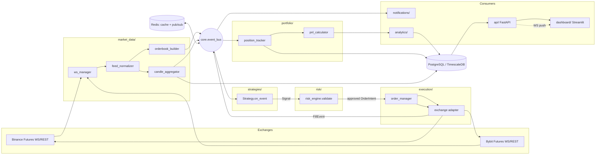
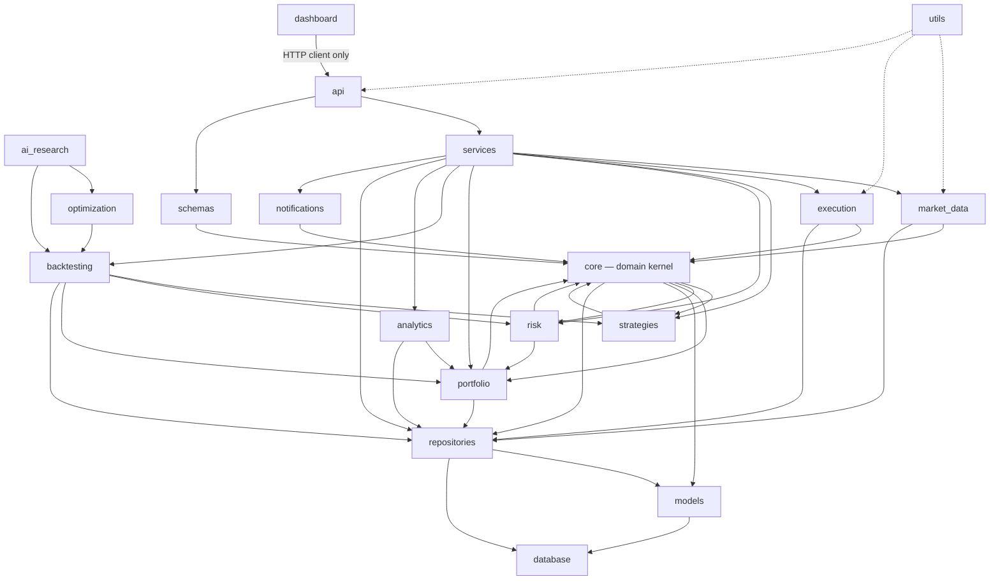
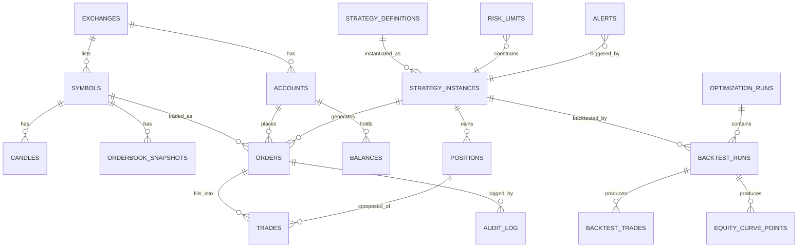
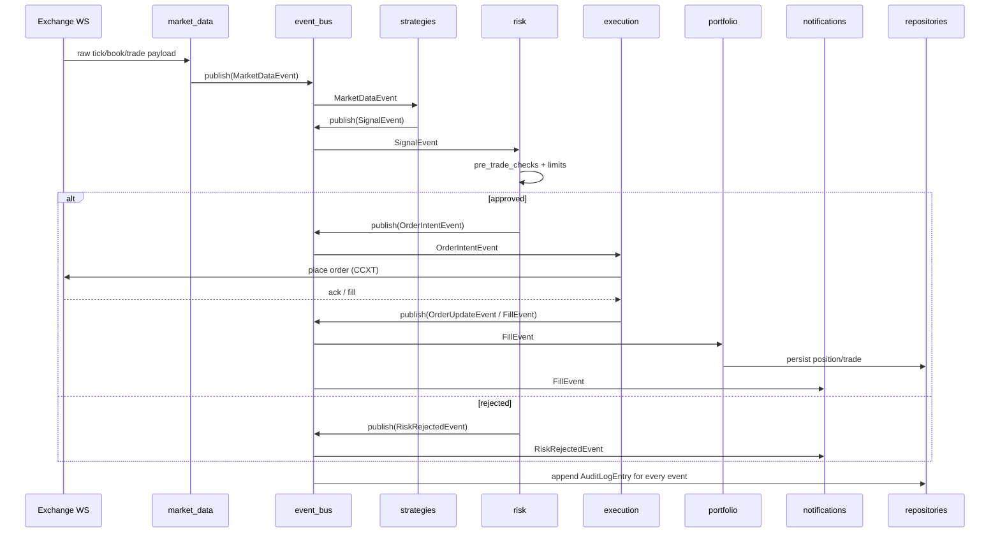
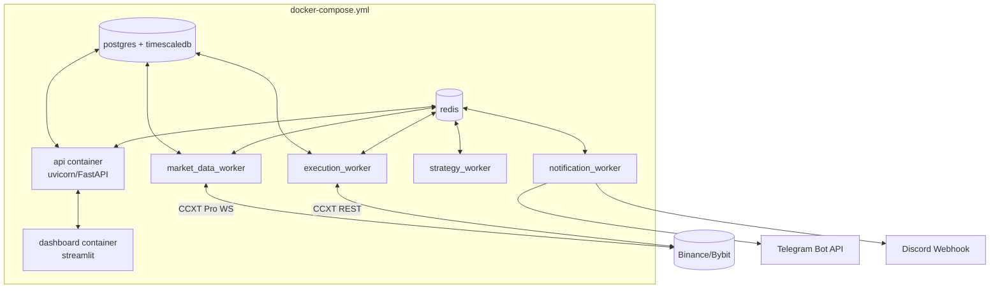

# Architecture Blueprint — Institutional Algorithmic Crypto Trading Platform

Status: **Planning phase — no production code has been written.** This document is the
architecture deliverable requested before implementation begins. It must be reviewed
and approved before any module in this tree is implemented.

Stack: Python 3.12+, FastAPI, PostgreSQL (+ TimescaleDB extension recommended for
time-series tables), Redis, Docker/Docker Compose, SQLAlchemy 2.x, Alembic, CCXT /
CCXT Pro, Pydantic v2, Pytest, Ruff, Black, Mypy, Streamlit, GitHub Actions.

---

## 1. Full Folder Structure

```
quant-trading-platform/
├── .github/
│   └── workflows/
│       ├── ci.yml                     # lint + typecheck + unit + integration
│       ├── docker-build.yml           # build & push images on merge to main
│       └── release.yml                # tag-triggered release pipeline
│
├── config/                            # environment & app configuration
│   ├── settings.py                    # Pydantic BaseSettings, per-env overrides
│   ├── logging.py                     # logging configuration factory
│   └── environments/
│       ├── development.env.example
│       ├── staging.env.example
│       └── production.env.example
│
├── core/                              # domain kernel — zero external deps
│   ├── exceptions.py                  # exception hierarchy
│   ├── constants.py
│   ├── enums.py                       # OrderSide, OrderType, TimeInForce, etc.
│   ├── types.py                       # domain value types (Symbol, Money, Price)
│   ├── events.py                      # event dataclasses (see §6)
│   ├── event_bus.py                   # pub/sub abstraction (in-proc + Redis)
│   └── interfaces/                    # ports (ABCs) implemented by outer layers
│       ├── exchange_gateway.py
│       ├── strategy.py
│       ├── repository.py
│       └── notifier.py
│
├── database/                          # infrastructure: persistence wiring
│   ├── session.py                     # async engine/session factory
│   ├── base.py                        # DeclarativeBase, mixins (timestamps, id)
│   └── alembic/
│       ├── versions/
│       └── env.py
│
├── models/                            # SQLAlchemy ORM models (persistence schema)
│   ├── market.py                      # Symbol, Candle, OrderBookSnapshot
│   ├── order.py
│   ├── trade.py
│   ├── position.py
│   ├── account.py                     # Exchange accounts, balances, API keys (encrypted)
│   ├── strategy.py                    # StrategyInstance, StrategyConfig
│   ├── backtest.py                    # BacktestRun, EquityCurvePoint
│   └── audit.py                       # AuditLogEntry, RiskEventLog
│
├── schemas/                           # Pydantic DTOs for API/service boundaries
│   ├── market.py
│   ├── order.py
│   ├── position.py
│   ├── strategy.py
│   ├── backtest.py
│   └── common.py                      # pagination, envelopes, error shapes
│
├── repositories/                      # data-access layer (repository pattern)
│   ├── base.py                        # generic CRUD repository
│   ├── market_repository.py
│   ├── order_repository.py
│   ├── trade_repository.py
│   ├── position_repository.py
│   ├── strategy_repository.py
│   └── backtest_repository.py
│
├── market_data/                       # live + historical market data subsystem
│   ├── ws_manager.py                  # connection lifecycle, reconnect/backoff
│   ├── feed_normalizer.py             # exchange-native payload → domain events
│   ├── orderbook_builder.py           # L2 book maintenance from diffs
│   ├── candle_aggregator.py           # trade/tick → OHLCV bar aggregation
│   ├── historical_loader.py           # REST backfill + gap detection
│   └── providers/
│       ├── binance_futures.py         # exchange-specific WS/REST glue
│       └── bybit_futures.py
│
├── execution/                         # order lifecycle & exchange adapters
│   ├── order_manager.py               # state machine: NEW→SUBMITTED→FILLED/…
│   ├── execution_router.py            # routes intents to correct exchange adapter
│   ├── reconciliation.py              # exchange vs local state reconciliation
│   └── adapters/
│       ├── base_adapter.py            # implements core.interfaces.exchange_gateway
│       ├── binance_adapter.py
│       └── bybit_adapter.py
│
├── strategies/                        # strategy plugin layer
│   ├── base_strategy.py               # abstract Strategy class
│   ├── registry.py                    # discovery & instantiation of plugins
│   ├── signal.py                      # Signal value object
│   └── examples/
│       ├── ma_crossover.py
│       └── mean_reversion.py
│
├── portfolio/                         # portfolio & position accounting
│   ├── portfolio_manager.py
│   ├── position_tracker.py
│   ├── pnl_calculator.py              # realized/unrealized PnL, funding accrual
│   └── allocator.py                   # capital allocation across strategies
│
├── risk/                              # pre-trade & portfolio risk controls
│   ├── risk_engine.py                 # orchestrates all checks
│   ├── position_sizing.py             # vol-target / fixed-fractional / Kelly-capped
│   ├── limits.py                      # exposure, leverage, concentration limits
│   ├── circuit_breaker.py             # drawdown kill-switch, error-rate trip
│   └── pre_trade_checks.py            # order-level validation pipeline
│
├── analytics/                         # performance measurement & reporting
│   ├── performance_metrics.py         # Sharpe, Sortino, Calmar, max DD, etc.
│   ├── attribution.py                 # per-strategy / per-symbol PnL attribution
│   ├── reporting.py                   # report generation (PDF/HTML export)
│   └── tearsheet.py
│
├── backtesting/                       # event-driven backtest engine
│   ├── engine.py                      # orchestrates simulated event loop
│   ├── event_simulator.py             # replays historical events in order
│   ├── data_feed.py                   # historical data source for the engine
│   ├── broker_simulator.py            # simulated OrderManager + fills
│   └── slippage_models.py             # fee/slippage/latency models
│
├── optimization/                      # parameter search & validation
│   ├── walk_forward.py                # rolling train/test optimizer
│   ├── param_search.py                # grid/random/Bayesian search
│   ├── objective_functions.py
│   └── overfitting_guards.py          # deflated Sharpe, CSCV, min sample size
│
├── ai_research/                       # AI-assisted strategy research
│   ├── llm_client.py                  # provider-agnostic LLM wrapper
│   ├── strategy_generator.py          # LLM-assisted strategy scaffolding
│   ├── research_agent.py              # hypothesis → backtest → report loop
│   └── prompts/
│
├── api/                               # FastAPI presentation layer
│   ├── main.py                        # app factory, router mounting, lifespan
│   ├── deps.py                        # DI providers (db session, current user)
│   ├── middleware/                    # auth, request-id, rate limit, error mapping
│   ├── v1/
│   │   ├── routers/
│   │   │   ├── market.py
│   │   │   ├── orders.py
│   │   │   ├── positions.py
│   │   │   ├── strategies.py
│   │   │   ├── backtests.py
│   │   │   └── system.py              # health, readiness, version
│   │   └── router.py                  # v1 aggregate router
│   └── websockets/
│       └── live_feed.py               # push market/portfolio updates to clients
│
├── services/                          # application/orchestration layer (use cases)
│   ├── market_data_service.py
│   ├── order_service.py
│   ├── strategy_service.py
│   ├── backtest_service.py
│   └── notification_service.py
│
├── dashboard/                         # Streamlit operator UI (talks to API only)
│   ├── app.py
│   ├── pages/
│   │   ├── overview.py
│   │   ├── positions.py
│   │   ├── strategies.py
│   │   ├── backtests.py
│   │   └── risk.py
│   └── components/                    # reusable charts/widgets
│
├── notifications/                     # outbound alerting
│   ├── base_notifier.py               # implements core.interfaces.notifier
│   ├── telegram_notifier.py
│   ├── discord_notifier.py
│   └── templates/                     # message templates per event type
│
├── utils/                             # cross-cutting, dependency-free helpers
│   ├── time_utils.py
│   ├── math_utils.py
│   ├── retry.py                       # backoff/retry decorators
│   ├── rate_limiter.py
│   └── serialization.py
│
├── tests/
│   ├── unit/                          # pure logic, mocked boundaries
│   ├── integration/                   # DB/Redis/API, real containers
│   ├── e2e/                           # full paper-trading loop vs testnet
│   ├── fixtures/                      # factories, sample market data
│   └── conftest.py
│
├── scripts/                           # operational one-offs
│   ├── seed_db.py
│   ├── run_backtest.py
│   └── migrate.py
│
├── docker/
│   ├── Dockerfile.api
│   ├── Dockerfile.worker              # market_data/execution/strategy workers
│   ├── Dockerfile.dashboard
│   └── entrypoint.sh
│
├── docs/
│   ├── ARCHITECTURE.md                # this file
│   ├── adr/                           # Architecture Decision Records
│   └── diagrams/
│
├── docker-compose.yml
├── docker-compose.override.yml        # local dev overrides
├── pyproject.toml                     # deps, ruff/black/mypy config, pytest config
├── alembic.ini
├── .env.example
├── .pre-commit-config.yaml
├── Makefile
├── README.md
└── TASKS.md
```

---

## 2. Folder-by-Folder Explanation

| Folder | Responsibility | Depends on |
|---|---|---|
| `config/` | Loads and validates environment configuration via Pydantic `BaseSettings`; central logging setup. | nothing internal |
| `core/` | The domain kernel: enums, value types, exceptions, event definitions, and **interfaces (ports)** that outer layers implement. Contains no I/O, no SQLAlchemy, no CCXT import. | nothing internal |
| `database/` | Wires SQLAlchemy engine/session and Alembic migration runtime. Infra only — no business logic. | `config` |
| `models/` | ORM row definitions. Mirrors the DB schema (§5). Never imported by `core` or `strategies`. | `database` |
| `schemas/` | Pydantic request/response/DTO contracts used at API and service boundaries. Keeps ORM models out of the API layer. | `core` |
| `repositories/` | Implements `core.interfaces.repository` per aggregate; the only layer allowed to write SQLAlchemy queries. | `models`, `database` |
| `market_data/` | Owns exchange WebSocket lifecycle, normalizes raw exchange payloads into `core.events` (`TickEvent`, `BookUpdateEvent`, `CandleEvent`), and historical backfill. | `core`, `execution.adapters` (for REST clients), `repositories` |
| `execution/` | Owns the order lifecycle state machine and exchange adapters implementing `core.interfaces.exchange_gateway` via CCXT/CCXT Pro. | `core`, `repositories` |
| `strategies/` | Plugin surface. Strategies only see `core.events`/`core.interfaces` and emit `Signal` objects — they cannot call exchanges or the DB directly. | `core` only |
| `portfolio/` | Tracks positions/balances/PnL from fills; the single source of truth for "what do we hold." | `core`, `repositories` |
| `risk/` | Intercepts every order intent before it reaches `execution`; enforces limits, sizing, and the kill-switch. | `core`, `portfolio` |
| `analytics/` | Derives performance statistics from portfolio/trade history — read-only consumer. | `portfolio`, `repositories` |
| `backtesting/` | Replays historical data through the **same** `strategies` + `risk` + `portfolio` code paths used live, with a simulated broker instead of `execution`. | `core`, `strategies`, `risk`, `portfolio`, `repositories` |
| `optimization/` | Drives `backtesting.engine` repeatedly across parameter grids / rolling windows. | `backtesting` |
| `ai_research/` | LLM-assisted hypothesis generation that produces strategy scaffolds and triggers `optimization`/`backtesting` runs; never touches live execution. | `strategies`, `backtesting` |
| `api/` | FastAPI HTTP/WS presentation layer; thin — delegates to `services/`. | `services`, `schemas` |
| `services/` | Application/use-case layer orchestrating repositories + domain modules for the API and background workers. | `repositories`, `market_data`, `execution`, `strategies`, `risk`, `portfolio`, `backtesting` |
| `dashboard/` | Streamlit UI. Talks **only** to the API (`api/`), never imports `database`/`models` directly, so the dashboard can be deployed independently. | `api` (HTTP client) |
| `notifications/` | Formats and delivers alerts for events emitted on the event bus. | `core` |
| `utils/` | Generic helpers with no domain knowledge (retry/backoff, time math, rate limiting). | nothing internal |
| `tests/` | Test suite, mirrors source tree. | everything |
| `scripts/` | Operational entry points for humans/cron, not imported by the app. | `services` |

**Clean Architecture dependency rule enforced:** arrows only point inward. `core/`
depends on nothing. `strategies/`, `risk/`, `portfolio/` depend only on `core/`.
`repositories/`, `execution/`, `market_data/` are infrastructure that implements
`core/interfaces`. `api/`, `dashboard/`, `services/` are the outermost layer and may
depend on everything beneath them, but nothing beneath depends back on them. This is
what makes `backtesting/` able to reuse live strategy code unmodified — it substitutes
a simulated adapter behind the same interface.

---

## 3. Data Flow Diagram



Key property: **market data and fills flow through one event bus.** Every downstream
consumer (strategies, portfolio, risk, notifications, analytics) subscribes to that
bus rather than being called directly — this is what lets backtesting replace the
exchange side without touching strategy/risk/portfolio code.

---

## 4. Module Dependency Diagram



Rule of thumb enforced by CI (via `ruff`/import-linter contracts, see §17/§18):
`core` never imports from any other first-party package; `strategies` never imports
`execution`, `database`, `models`, or `api`.

---

## 5. Database Schema

Recommendation: PostgreSQL with the **TimescaleDB** extension enabled for the
time-series-heavy tables (`candles`, `trades`, `orderbook_snapshots`,
`equity_curve_points`). If TimescaleDB is not available in the deployment target,
these tables still work as plain partitioned Postgres tables (partition by month on
`ts`), so the extension is an optimization, not a hard dependency.



### Core tables

**`exchanges`** — `id, name, ccxt_id, is_futures, is_active, created_at`

**`symbols`** — `id, exchange_id FK, base_asset, quote_asset, symbol_native, contract_type, tick_size, lot_size, is_active`

**`accounts`** — `id, exchange_id FK, label, api_key_encrypted, api_secret_encrypted, permissions (enum: read_only/trade), is_paper, created_at`
> API credentials are encrypted at the application layer (Fernet/KMS) before storage — see §13.

**`balances`** — `id, account_id FK, asset, free, locked, ts` (snapshot table, latest-per-account queried via index; history retained for reconciliation)

**`candles`** (hypertable, partition key `ts`) — `symbol_id FK, timeframe, ts, open, high, low, close, volume, trade_count`, PK `(symbol_id, timeframe, ts)`

**`orderbook_snapshots`** (hypertable) — `symbol_id FK, ts, bids JSONB, asks JSONB, sequence_id`

**`strategy_definitions`** — `id, name, plugin_module_path, version, description, param_schema JSONB, created_at`

**`strategy_instances`** — `id, strategy_definition_id FK, name, mode (enum: backtest/paper/live), params JSONB, allocated_capital, status (enum: active/paused/stopped), created_at`

**`orders`** — `id, exchange_order_id, strategy_instance_id FK, account_id FK, symbol_id FK, side, order_type, time_in_force, quantity, price, status (enum: NEW/SUBMITTED/PARTIALLY_FILLED/FILLED/CANCELED/REJECTED/EXPIRED), submitted_at, updated_at, client_order_id (idempotency key, unique)`

**`trades`** — `id, order_id FK, exchange_trade_id, quantity, price, fee, fee_asset, is_maker, ts`

**`positions`** — `id, strategy_instance_id FK, symbol_id FK, side, quantity, entry_price, unrealized_pnl, realized_pnl, leverage, updated_at`

**`backtest_runs`** — `id, strategy_instance_id FK, params JSONB, start_date, end_date, initial_capital, status, final_equity, sharpe, max_drawdown, created_at`

**`backtest_trades`** — `id, backtest_run_id FK, symbol_id FK, side, quantity, entry_price, exit_price, entry_ts, exit_ts, pnl`

**`equity_curve_points`** (hypertable) — `backtest_run_id FK NULLABLE, strategy_instance_id FK NULLABLE, ts, equity, drawdown_pct` (nullable FKs distinguish live vs backtest curves sharing one table, or split into two tables if preferred — an ADR decision, see §17 process)

**`optimization_runs`** — `id, strategy_definition_id FK, search_type (grid/random/bayesian), objective, param_space JSONB, status, created_at`

**`risk_limits`** — `id, scope (enum: global/strategy/symbol), scope_id, max_position_notional, max_leverage, max_daily_loss, max_drawdown_pct, is_active`

**`audit_log`** — `id, actor (enum: system/user/strategy), action, entity_type, entity_id, payload JSONB, ts` — append-only, never updated/deleted.

**`alerts`** — `id, severity, source, message, context JSONB, delivered_channels JSONB, ts`

Indexing notes: composite index on `orders(strategy_instance_id, status)`, unique
index on `orders(client_order_id)` for idempotent submission, BRIN or Timescale
chunk-based indexing on all `ts` columns, `positions(strategy_instance_id, symbol_id)`
unique for the "current position" row.

---

## 6. Event Flow

`core/events.py` defines an immutable event hierarchy; `core/event_bus.py` provides an
abstraction with two implementations: an **in-process asyncio bus** (used inside a
single worker, and always used inside the backtesting engine for determinism) and a
**Redis Streams/Pub-Sub bus** (used to fan events out across separate worker
processes/containers in live/paper mode).



Event types (non-exhaustive): `TickEvent`, `BookUpdateEvent`, `CandleEvent`,
`SignalEvent`, `OrderIntentEvent`, `OrderUpdateEvent`, `FillEvent`,
`RiskRejectedEvent`, `CircuitBreakerTrippedEvent`, `PortfolioUpdateEvent`,
`AlertEvent`. Every event carries `event_id`, `ts`, `source`, `correlation_id`
(propagated from the originating market data tick through to the resulting fill, for
end-to-end tracing).

**Determinism guarantee:** the backtesting engine drives the exact same
`strategies → risk → portfolio` consumers through the in-process bus, replacing only
`market_data`'s live source with `backtesting.data_feed` and `execution`'s live
adapter with `backtesting.broker_simulator`. This is the architectural centerpiece
that prevents backtest/live logic divergence.

---

## 7. Risk Management Architecture

Risk is enforced in **layers**, each of which can independently block an order:

1. **Strategy-level config validation** — `param_schema` on `strategy_definitions`
   validated by Pydantic at instantiation time (e.g., max leverage a strategy is
   even allowed to request).
2. **Pre-trade checks** (`risk/pre_trade_checks.py`) — run synchronously on every
   `SignalEvent` before it becomes an `OrderIntentEvent`:
   - Notional/leverage within `risk_limits` for that strategy/symbol/account.
   - Position concentration (max % of portfolio in one symbol/sector).
   - Order size sanity (min/max qty, tick/lot compliance) to avoid fat-finger/exchange rejects.
   - Duplicate/idempotency check via `client_order_id`.
3. **Position sizing** (`risk/position_sizing.py`) — converts a directional `Signal`
   into a sized order using a pluggable model (fixed-fractional, volatility-target,
   Kelly-capped). This runs *before* pre-trade checks re-validate the sized result.
4. **Portfolio-level limits** (`risk/limits.py`) — aggregate exposure across all
   strategies sharing an account (gross/net exposure, correlation-adjusted exposure,
   max concurrent open positions).
5. **Circuit breaker** (`risk/circuit_breaker.py`) — a global kill switch that trips on:
   - Daily loss exceeding `max_daily_loss`.
   - Drawdown exceeding `max_drawdown_pct`.
   - Abnormal error/reject rate from an exchange adapter (protects against a broken
     integration hammering the exchange or trading on stale data).
   - Manual operator trip via API/dashboard.
   When tripped: reject all new `OrderIntentEvent`s, optionally auto-flatten open
   positions (configurable per severity), and emit `CircuitBreakerTrippedEvent` →
   notifications at highest severity.
6. **Post-trade reconciliation** (`execution/reconciliation.py`) — periodically diffs
   local `positions`/`orders` state against exchange-reported state; mismatches raise
   an `AlertEvent` and can auto-trip the circuit breaker.

Risk limits are **data, not code** (`risk_limits` table) so they can be tuned without
a deploy, and every change to them is written to `audit_log`.

---

## 8. Strategy Plugin Architecture

```
core.interfaces.strategy.Strategy (ABC)
    ├── on_market_data(event: MarketDataEvent) -> None
    ├── on_fill(event: FillEvent) -> None
    ├── on_start(context: StrategyContext) -> None
    ├── on_stop(context: StrategyContext) -> None
    └── params: PydanticModel (declares its own config schema)
```

- **Isolation**: a strategy only ever receives `core.events` and returns `Signal`
  objects; it has no reference to the exchange adapter, DB session, or event bus
  directly. This makes strategies trivially unit-testable and prevents a
  misbehaving strategy from bypassing risk checks.
- **Registry** (`strategies/registry.py`): strategies self-register via a decorator
  (`@register_strategy("ma_crossover")`) or Python entry-points
  (`pyproject.toml [project.entry-points."quant.strategies"]`) so third-party/private
  strategy packages can be installed without modifying this repo — this is the
  extension point for "plugin architecture."
- **Config-driven instantiation**: `strategy_instances.params` (JSONB) is validated
  against the strategy's declared Pydantic schema at load time; invalid configs fail
  fast before any capital is allocated.
- **Context object**: `StrategyContext` passed at `on_start` exposes *read-only*
  helpers (current position, recent candles) backed by `portfolio`/`repositories`,
  never raw DB/exchange handles.
- **Versioning**: `strategy_definitions.version` + git-tracked plugin module path
  means a live strategy instance always records exactly which code version produced
  its signals, for audit and reproducibility.

---

## 9. Exchange Abstraction Architecture

```
core.interfaces.exchange_gateway.ExchangeGateway (ABC)
    ├── async def fetch_balance()
    ├── async def place_order(order: OrderIntent) -> OrderAck
    ├── async def cancel_order(order_id)
    ├── async def fetch_open_orders()
    ├── async def watch_orderbook(symbol) -> AsyncIterator[BookUpdate]
    ├── async def watch_trades(symbol) -> AsyncIterator[Trade]
    └── def normalize_symbol(native: str) -> Symbol
```

- Implemented per exchange in `execution/adapters/{binance,bybit}_adapter.py` on top
  of **CCXT Pro** for WS (`watch_*`) and **CCXT** for REST (order placement,
  balances). CCXT already normalizes most payload shapes; the adapter layer exists so
  the rest of the platform never imports `ccxt` directly and exchange-specific quirks
  (funding rate field names, futures vs spot symbol formats, rate-limit buckets) are
  contained in one place per exchange.
- **Symbol mapping**: `symbols.symbol_native` stores the exchange's own string;
  `normalize_symbol` maps it to the platform's canonical `Symbol` value type so
  strategies reason in exchange-agnostic terms (`BTC/USDT:USDT` perp) while adapters
  handle exchange string formats.
- **Rate limiting**: `utils/rate_limiter.py` wraps each adapter's REST calls with a
  token-bucket matched to the exchange's documented limits; CCXT's built-in throttler
  is used as the first line of defense, the platform-level limiter is a safety net
  shared across all workers hitting the same account.
- **Adding a new exchange** = implement one adapter class + register its symbols;
  no changes required in `strategies`, `risk`, `portfolio`, or `backtesting`. This is
  the mechanism that satisfies "multiple exchanges later."
- **Paper trading** is a third adapter (`execution/adapters/paper_adapter.py`,
  to be added when that milestone is implemented) that fills orders against live
  market data with a simulated fill model, satisfying the same `ExchangeGateway`
  interface — so a strategy instance moves from paper → live by swapping accounts,
  not code.

---

## 10. Backtesting Architecture

Event-driven (not vectorized) by design, so strategy code is byte-for-byte identical
between backtest and live:

```mermaid
flowchart LR
    HIST[(historical candles/trades\nin Postgres)] --> FEED[backtesting.data_feed]
    FEED --> SIM[event_simulator\n(time-ordered replay)]
    SIM -->|MarketDataEvent| BUS[in-process event_bus]
    BUS --> STRAT[strategies — same code as live]
    STRAT -->|Signal| RISK[risk — same code as live]
    RISK -->|OrderIntent| BROKER[broker_simulator]
    BROKER -->|fills w/ slippage+fees+latency| BUS
    BUS --> PORT[portfolio — same code as live]
    PORT --> CURVE[equity_curve_points]
    CURVE --> METRICS[analytics.performance_metrics]
```

- **`broker_simulator`** stands in for `execution/adapters/*` behind the same
  `ExchangeGateway` interface, so `order_manager` code is also reused, not
  reimplemented.
- **`slippage_models.py`** supports pluggable fill assumptions: next-bar-open,
  volume-participation cap, fixed bps slippage, and orderbook-depth-aware fills when
  L2 history is available.
- **Look-ahead bias prevention**: `event_simulator` guarantees strategies only ever
  observe events with `ts <= current_sim_time`; any repository query issued by a
  strategy's context object during a backtest is time-boxed to the same cutoff.
- **Costs modeled**: exchange taker/maker fees (from `symbols`), funding rate accrual
  for perpetuals, and slippage — all configurable per backtest run and stored on
  `backtest_runs.params` for reproducibility.
- **Output**: every backtest run persists `backtest_trades` +
  `equity_curve_points` + summary stats on `backtest_runs`, so results are queryable
  and comparable across runs, not just printed to console.

---

## 11. Optimization (Walk-Forward) Architecture

```
optimization/walk_forward.py
    for each rolling window (train_period, test_period):
        param_search.search(strategy, train_period, param_space)  → best params (in-sample)
        backtesting.engine.run(strategy, test_period, best_params) → out-of-sample result
    aggregate out-of-sample results only → true performance estimate
```

- `param_search.py` supports grid, random, and Bayesian search strategies behind one
  interface, all driving `backtesting.engine.run`.
- `overfitting_guards.py` implements deflated Sharpe ratio and a minimum
  trade-count/sample-size gate before a parameter set is allowed to graduate from
  backtest → paper.
- Every walk-forward run is a persisted `optimization_runs` row referencing all its
  child `backtest_runs`, so the in-sample/out-of-sample split is auditable later —
  this directly guards against the single biggest failure mode of retail strategy
  development (overfitting to one backtest).

---

## 12. Dashboard Architecture

- Streamlit app (`dashboard/`) is a **pure API client** — it calls `api/` over HTTP
  and the WS endpoint for live updates; it never imports `models`/`database`/
  `repositories` directly. This keeps the dashboard deployable as an independent
  container (or even off-box) and keeps a single authorization boundary (the API) in
  front of all data.
- Pages: **Overview** (equity curve, open risk, circuit-breaker status), **Positions**
  (live positions across exchanges/strategies), **Strategies** (per-strategy
  performance, start/pause/stop controls calling `api/v1/strategies`), **Backtests**
  (run history, tearsheet viewer), **Risk** (current limits, recent risk rejections,
  manual kill-switch).
- Real-time updates: initial page load hits REST; live deltas subscribe to
  `api/websockets/live_feed.py`, which itself subscribes to the Redis event bus and
  fans out to connected dashboard/browser clients.

---

## 13. Deployment Architecture



- **Local/staging**: `docker-compose.yml` runs everything on one host, one process
  per service — simplest operational model, matches current scale.
- **Process separation rationale**: `market_data_worker` (WS-bound, must never block),
  `strategy_worker` (CPU for signal computation), and `execution_worker` (latency
  sensitive REST calls) are separate containers so a slow strategy computation cannot
  delay order placement, and a market-data reconnect storm cannot starve execution.
  All communicate only via the Redis event bus — no direct RPC between workers.
- **Config**: one `.env` per environment (`development`/`staging`/`production`),
  loaded by `config/settings.py`; never baked into images.
- **Scaling path**: each worker type is independently horizontally scalable (e.g.
  multiple `strategy_worker` replicas partitioned by `strategy_instance_id`); DB and
  Redis are the shared state. A future move to Kubernetes (§19) changes only the
  orchestration layer, not the application boundaries, because services already
  communicate over the network (Postgres/Redis), not in-process.
- **Migrations**: run via a dedicated `migrate` job/init-container (`alembic upgrade
  head`) before `api`/workers start — never run migrations from application startup
  code.

---

## 14. Security Considerations

- **Secrets**: exchange API keys stored encrypted at rest (`accounts.api_key_encrypted`
  via Fernet with a key from env/secrets manager, moving to a KMS/Vault in
  production). Never logged; `utils`/logging middleware redact known secret field
  names.
- **Least privilege on exchange keys**: separate keys per environment; live-trading
  keys scoped to trade-only (no withdrawal permission) at the exchange level — this
  is an operational control to document in `README.md`, not something the code can
  enforce, but the `accounts.permissions` field records the intended scope for audit.
- **API authentication**: FastAPI endpoints behind JWT auth (`api/middleware/auth.py`);
  the dashboard authenticates as a service client. No unauthenticated route except
  `/health`.
- **Network exposure**: only `api/` and `dashboard/` are exposed via a reverse proxy;
  Postgres/Redis stay on the internal Docker network, never published to a host port
  in production.
- **Kill switch access control**: manual circuit-breaker trip is a privileged,
  audited action (`audit_log`), separate from ordinary strategy start/stop
  permissions.
- **Input validation**: every external boundary (API request bodies, exchange WS
  payloads before normalization) validated through Pydantic — malformed exchange
  payloads are logged and dropped, never trusted into `core.events` unvalidated.
- **Dependency hygiene**: `pyproject.toml` pinned versions; GitHub Actions runs a
  dependency/CVE scan (e.g. `pip-audit`) in CI (§18).
- **Idempotency**: `orders.client_order_id` unique constraint prevents duplicate
  order submission on retry (critical given retry/backoff is used throughout
  execution and network calls to exchanges are not naturally idempotent).

---

## 15. API Design

- **Style**: REST, versioned under `/api/v1`, resource-oriented, JSON:API-flavored
  envelopes defined in `schemas/common.py` (consistent pagination + error shape).
- **Routers** (`api/v1/routers/`): `market` (symbols, candles query),
  `orders` (list/cancel — creation is via strategies/risk, not direct user POST, to
  keep risk checks mandatory), `positions`, `strategies` (CRUD strategy instances,
  start/pause/stop), `backtests` (submit run, fetch results/tearsheet), `system`
  (health, readiness, circuit-breaker status/trip).
- **WebSocket**: `/ws/live` streams `PortfolioUpdateEvent`/`FillEvent`/`AlertEvent`
  to authenticated clients (dashboard) — thin bridge over the Redis bus, no business
  logic in the WS handler itself.
- **Auto-generated OpenAPI** (`/docs`) is the contract between `dashboard` and `api`
  and any future external client; `schemas/` are the single source of truth so
  request/response shapes never drift from documentation.
- **Error contract**: every domain exception in `core/exceptions.py` maps to a
  specific HTTP status via a FastAPI exception handler (`api/middleware/`), returning
  a consistent `{error_code, message, details}` body — never a raw stack trace.

---

## 16. Logging Design

- Structured JSON logging everywhere (stdlib `logging` + a JSON formatter, or
  `structlog`), configured centrally in `config/logging.py` — no module configures
  its own handlers.
- Every log line includes: `ts`, `level`, `logger`, `correlation_id` (propagated from
  the originating `core.events` event through the whole pipeline — see §6),
  `strategy_instance_id` where applicable, `message`, structured `extra` fields.
- Log levels: `DEBUG` for local dev, `INFO` baseline in staging/production,
  `WARNING`+ for risk rejections/reconnects, `ERROR` for failed order placement/DB
  errors, `CRITICAL` reserved for circuit-breaker trips.
- Secrets/PII redaction filter applied globally before any handler.
- Output: stdout (container-native); a later milestone wires shipping to a
  centralized store (Loki/ELK) — the JSON format is chosen now specifically so that
  addition requires no application changes later.

---

## 17. Error Handling Strategy

- **Exception hierarchy** (`core/exceptions.py`): `DomainError` base, with subtypes
  `ValidationError`, `RiskRejectedError`, `InsufficientBalanceError`,
  `ExchangeError` (→ `RateLimitError`, `OrderRejectedError`, `ConnectivityError`),
  `ReconciliationMismatchError`. Every layer raises these, never bare exceptions.
- **Retry policy** (`utils/retry.py`): exponential backoff with jitter for
  transient `ExchangeError`/`ConnectivityError` on REST calls and WS reconnects;
  explicitly **not** retried: `OrderRejectedError` (would double-submit) — those
  surface immediately to `risk`/`notifications`.
- **Circuit breaking on integration failure**: repeated `ExchangeError` from one
  adapter within a window trips a per-exchange breaker (distinct from the
  portfolio-risk circuit breaker in §7) that pauses order routing to that exchange
  only, while other exchanges keep operating.
- **API layer**: FastAPI exception handlers translate `DomainError` subtypes to HTTP
  4xx/5xx with the consistent error envelope (§15); unhandled exceptions are caught
  by a top-level handler that logs full context and returns a generic 500 (never
  leaks internals to the client).
- **Background workers**: each event-bus consumer wraps handling in a
  try/except that logs + emits an `AlertEvent` on failure rather than crashing the
  worker process — one bad event must not take down the market-data/execution loop.
- **Dead-letter handling**: events that fail processing after retries are persisted
  to a `failed_events` outbox (added at the reliability-hardening milestone) for
  manual/automated replay instead of being silently dropped.

---

## 18. Testing Strategy

Pyramid, mirroring `tests/unit|integration|e2e`:

- **Unit** (`tests/unit/`): pure-logic tests with all boundaries mocked —
  strategies (feed synthetic `MarketDataEvent`s, assert `Signal`s), risk calculators,
  position sizing, PnL math, slippage models. Fast, run on every commit.
- **Integration** (`tests/integration/`): real Postgres + Redis via
  docker-compose test stack (or testcontainers), exercising repositories, Alembic
  migrations, the event bus, and API routes end-to-end against a test DB.
- **E2E** (`tests/e2e/`): full paper-trading loop against exchange **testnets**
  (Binance/Bybit testnet), run less frequently (nightly/manual) since they depend on
  external systems.
- **Backtest regression tests**: golden-dataset fixtures with known expected metrics
  (Sharpe, trade count, final equity) so a refactor of `backtesting.engine` that
  silently changes results fails CI.
- **Property-based tests** (Hypothesis) for critical numeric code: position sizing
  never exceeds configured risk limits, PnL calculation is invariant under
  buy/sell order permutation for the same fills, etc.
- **Coverage gate**: enforced in CI for `core/`, `risk/`, `portfolio/`,
  `backtesting/` specifically (the modules where a silent bug is costliest) rather
  than a single blanket repo-wide number.
- **Import-boundary tests**: a lint rule (import-linter or a small custom AST check)
  asserting `strategies/` never imports `execution`/`database`/`api`, enforcing the
  Clean Architecture rule from §2/§4 automatically.

---

## 19. CI/CD Pipeline

`.github/workflows/ci.yml` (runs on every PR and push to main):

1. **Setup** — checkout, set up Python 3.12, cache `uv`/pip.
2. **Lint & format** — `ruff check .`, `black --check .`.
3. **Type check** — `mypy .`.
4. **Import-boundary check** — Clean Architecture dependency rule enforcement (§18).
5. **Unit tests** — `pytest tests/unit --cov`.
6. **Integration tests** — spin up `postgres`/`redis` as GitHub Actions service
   containers, run `alembic upgrade head`, `pytest tests/integration`.
7. **Dependency audit** — `pip-audit`.
8. **Backtest regression suite** — golden-dataset comparison (§18).

`.github/workflows/docker-build.yml` (on merge to `main`):
9. Build `Dockerfile.api`/`Dockerfile.worker`/`Dockerfile.dashboard`, tag with commit
   SHA + `latest`, push to registry.

`.github/workflows/release.yml` (on version tag):
10. Re-run full CI, build + push versioned images, generate changelog, create GitHub
    Release. Deployment to staging/production is a separate, manually-triggered or
    approval-gated job — this platform moves real money, so no tag automatically
    deploys to production without an explicit approval step.

E2E tests against exchange testnets run on a schedule (nightly), not on every PR,
since they're slower and depend on third-party uptime.

---

## 20. Future Roadmap

Beyond the milestones in `TASKS.md`, directional future work:

- **More exchanges**: OKX, Deribit (options), Hyperliquid — validates the exchange
  abstraction (§9) holds up beyond the first two.
- **Multi-account / multi-tenant**: support multiple funds/users with isolated risk
  budgets and reporting on one deployment.
- **Low-latency execution path**: colocated execution service, WebSocket order
  entry where exchanges support it, reduced REST round-trips for latency-sensitive
  strategies.
- **FIX protocol support** for venues that offer it, as a new `execution/adapters/`
  implementation behind the same `ExchangeGateway` interface.
- **Distributed strategy execution**: move from Redis pub/sub to Kafka if
  event volume/replay/consumer-group needs outgrow Redis Streams.
- **ML/AI-driven research loop maturation**: `ai_research/` grows from
  scaffold-generation into automated hypothesis → backtest → walk-forward → report
  cycles with human-in-the-loop approval gates before any AI-originated strategy
  reaches paper trading.
- **Compliance/audit module**: trade reporting exports, position/exposure reports
  formatted for regulatory or investor reporting.
- **Kubernetes deployment**: once horizontal scaling needs exceed single-host
  docker-compose, move workers to k8s Deployments/HPA — no application-layer changes
  needed since workers already only communicate via Postgres/Redis (§13).
- **Mobile companion app**: read-only portfolio/alerts view consuming the same
  `api/` used by the dashboard.
- **Options/derivatives strategy support**: extend `core.types`/`models` for
  options greeks, funding-rate arbitrage strategies across the multi-exchange
  abstraction.

---

## Cross-Cutting Design Principles (summary)

1. **One event bus, two bus backends** (in-process for backtest determinism, Redis
   for live process separation) — strategies/risk/portfolio code never changes
   between backtest and live.
2. **Ports and adapters**: `core/interfaces` are the only contracts `strategies`,
   `risk`, `portfolio` depend on; `execution/adapters` and
   `backtesting/broker_simulator` are interchangeable implementations of
   `ExchangeGateway`.
3. **Risk limits as data**: tunable without redeploying, always audited.
4. **The dashboard is just an API client**: no privileged direct DB access, so the
   authorization boundary is singular.
5. **Everything time-boxed and correlation-tracked**: from a market tick to the
   resulting fill to the resulting alert, one `correlation_id` ties the whole chain
   together in logs and `audit_log`.

See `TASKS.md` for the milestone-by-milestone implementation plan derived from this
architecture. No implementation should begin until this document is reviewed and
approved.
